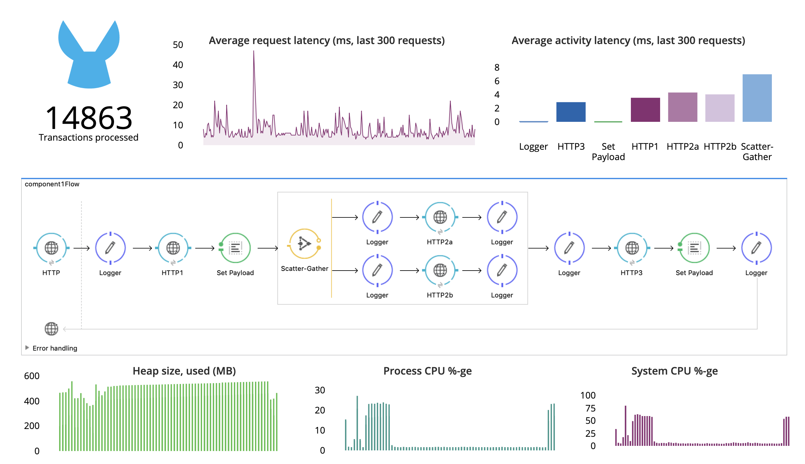

# Elastic APM Mule3 Agent
## Intro
This addon allows application performance monitoring of Mule 3.x components using Elastic APM. It provides a non-intrusive way to measure and benchmark individual flows and steps in Mule, adding the application performance monitoring of Mule components to reside in Elasticsearch alongside logs, metrics and other data. Mule APM agent supports distributed tracing allowing propagation of trace context using transport protocol meta-data, such as HTTP headers, and can present a unified view of the same trace spanning multiple components, built in Mule and other supported technologies. For more information about Elastic APM see [this link](https://www.elastic.co/solutions/apm). Also, feel free to check out the [sample app](example-app).

## How it works
The agent is converting the top level flow into APM trace and transactions, all the flow steps and flow references into APM spans linked to the top level transaction, as well as all the flow references that invoke the flow step as child spans. The implementation also allows capturing input and output properties in Mule flow, turning them into Transaction tags. From that point on, all the features of Elastic APM can be applied, such as standard and custom visualisations in Kibana, machine learning, as well as other features of the Elastic stack. The two images below illustrate how a given Mule flow is translated into APM transaction and underlying hierarchical spans. See below example Mule flow and how this flow will be represented in Elastic APM:


APM transaction view:


Example Canvas visualisation (built for `example-app`, see `kibana-objs` folder):


## Setup

### Important: Mule 3.8 and 3.9
Mule 3.9 introduced compatibility breaking changes in some of the interfaces. Also, Mule 3.8 support was added after I built the agent for Mule 3.9, so to work with Mule 3.8 all the dependencies have to be named as `apm-mule3.8-agent` for Mule 3.8 versions, and `apm-mule3-agent` for Mule 3.9 versions.

### Get the jar from the release you are after
Go to the [Releases](https://github.com/michaelhyatt/elastic-apm-mule3-agent/releases) tab in github abd download the jar file. Then, install it into your local Maven repo:

Mule 3.9:
```
mvn install:install-file -Dfile=<path-to-file> -DgroupId=co.elastic.apm \
    -DartifactId=apm-mule3-agent -Dversion=1.8.0 -Dpackaging=jar
```

Mule 3.8:
```
mvn install:install-file -Dfile=<path-to-file> -DgroupId=co.elastic.apm \
    -DartifactId=apm-mule3.8-agent -Dversion=1.8.0 -Dpackaging=jar
```

### Or, get the code and build it from scratch
Download the code by `git clone https://github.com/michaelhyatt/elastic-apm-mule3-agent`. Install the jar in your Maven repo by `mvn install -Pjar`.

### Don't forget to add the following dependency to your Mule project POM file:

Mule 3.9:
```xml
<dependency>
    <groupId>co.elastic.apm</groupId>
    <artifactId>apm-mule3-agent</artifactId>
    <version>1.8.0</version>
</dependency>
```

Mule 3.8:
```xml
<dependency>
    <groupId>co.elastic.apm</groupId>
    <artifactId>apm-mule3.8-agent</artifactId>
    <version>1.8.0</version>
</dependency>
```

### Enabling debugging within Mule flow
This is a good way to enable debugging in standalone Mule workers. Add the tracer to the main Mule flow. This import will ensure all the relevant modules for tracing will get loaded and connection will be made to your Elastic APM server:
```xml
<spring:beans>
    <spring:import resource="classpath:co/elastic/apm/mule/tracer.xml"/>
</spring:beans>
```

### Enabling debugging in Mule applications deployed into the same domain
Add the following to `mule-domain-config.xml` file within your domain. It will inject the APM client into all the projects deployed for this domain.
```xml
<spring:beans>
    <spring:import resource="classpath:co/elastic/apm/mule/domain-tracer.xml" />
</spring:beans>
```

### Mule property configuration.
Make sure to add the following configuration options to your `mule-app.properties` file configuring your Mule application. More information about the available configuration properties for APM module can be found here - https://www.elastic.co/guide/en/apm/agent/java/current/config-core.html
```properties
# Elastic Apm Java client properties
elastic.apm.log_level=DEBUG
elastic.apm.instrument=false
elastic.apm.active=true

# APM server running locally
elastic.apm.server_urls=http://localhost:8200

# Or, try APM on Elastic Cloud. Create trial deployment and update the below details
#elastic.apm.server_urls=https://xxxxxxxxxxxxxxxx.apm.ap-northeast-1.aws.cloud.es.io:443
#elastic.apm.secret_token=<secret_key>

elastic.apm.application_packages=
elastic.apm.service_name=component1
elastic.apm.service_version=v1.0.0
elastic.apm.stack_trace_limit=3
elastic.apm.span_frames_min_duration=0ms

# Mule apm specific properties
elastic.apm.mule.capture_input_properties=true
elastic.apm.mule.capture_input_properties_regex=http_(.*)

elastic.apm.mule.capture_output_properties=true
elastic.apm.mule.capture_output_properties_regex=(.*)
```

### Configuration using JVM command line and environment variables
Alternatively, it is possible to configure the APM agent using command line properties passed using the command line switch `-D`:
```properties
-Delastic.apm.log_level=INFO
-Delastic.apm.instrument=false
-Delastic.apm.active=true
-Delastic.apm.server_urls=http://localhost:8200
-Delastic.apm.application_packages=
-Delastic.apm.service_name=path-component
-Delastic.apm.service_version=v1.0.0
-Delastic.apm.stack_trace_limit=30
-Delastic.apm.span_frames_min_duration=0ms
-Delastic.apm.mule.capture_input_properties=true
-Delastic.apm.mule.capture_input_properties_regex=http_(.*)
-Delastic.apm.mule.capture_output_properties=true
-Delastic.apm.mule.capture_output_properties_regex=(.*)
```
Also, environment variables are supported, as per [Elastic APM Java agent configuration guide](https://www.elastic.co/guide/en/apm/agent/java/current/config-core.html).

### Capturing flowVar values as Span tags
To capture value of flowVars, it is possible to configure a regular expression matching the flowVar name and flow step name that will be used to capture the value of the flowVar as a Span tag:
```properties
# Enable flowVar capture into Span tags
elastic.apm.mule.capture_flowvars=true

# Capture all flowVars with names matching 'var*' at a flow step named "HTTP"
elastic.apm.mule.capture_at_HTTP=var.*
```

## Support for distributed tracing
The agent supports distributed tracing by propagating the trace context in property `elastic-apm-traceparent`. Protocols, such as HTTP, that can convert outbound properties into relevant protocol meta-data, i.e. HTTP headers, don't need to take any special precautions. Other protocols that ignore outbound properties, will need to explicitly map the above property into appropriate protocol related header or property.

## Things to know and consider
* Requires Maven 3.x to build jar file.
* Works with both, Mule 3.9 and 3.8, CE and EE.
* Mule 3.8 requires separate dependency, as per above.
* Only captures input and output properties, no flowVars at this stage.
* Compatible with Elastic stack versions including APM 7.x and 6.5+ and uses APM Java client v1.6.0.
* Elastic APM - https://www.elastic.co/solutions/apm
* For the rest of configuration parameters, see Elastic APM Java client documentation - https://github.com/elastic/apm-agent-java
